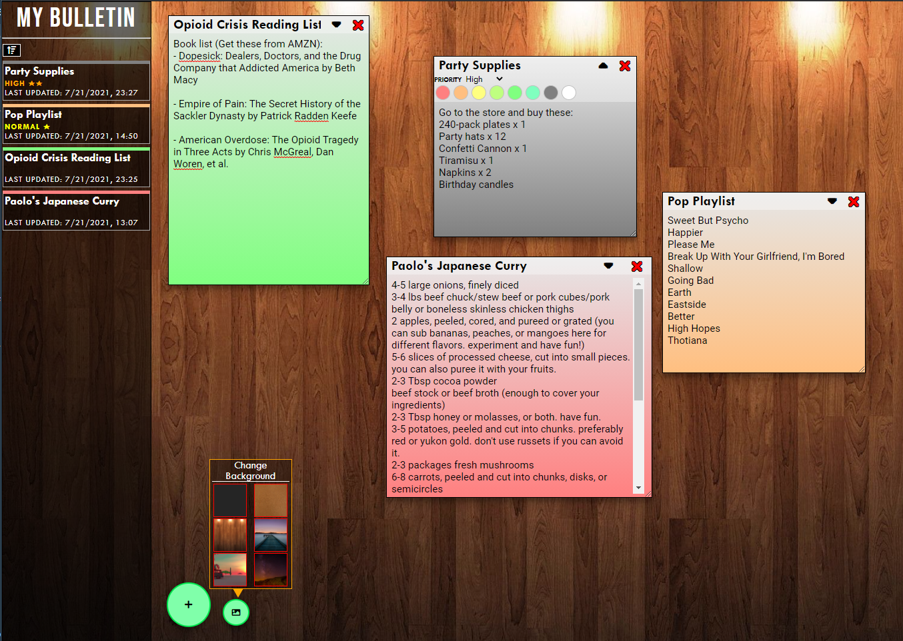

# My Bulletin Board

A basic bulletin board with the ability to create sticky notes. It uses 
your browser's local storage to store the sticky notes.

## Features
- Create sticky notes to jot down various notes.
- Manipulate the placement of sticky notes like you would on your desktop.
- View your active sticky notes with a notes list on the side.
- Change the color of your sticky notes.
- Personalize the background of the bulletin board.
- An auto-save feature saves your sticky notes when you exit or refresh.

